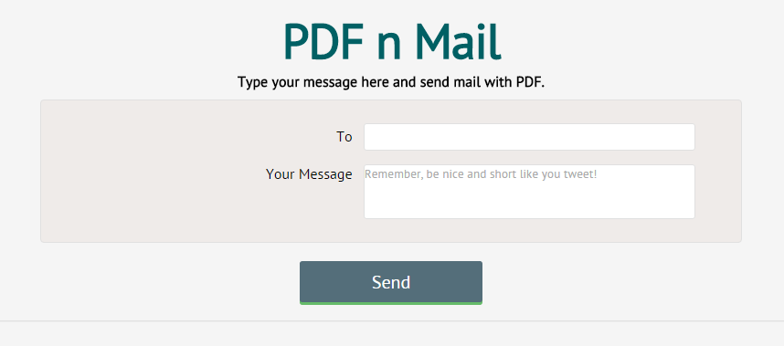

# PDFnMail
Create PDF on client side using jsPDF and send it as a mail attachment. Check out the demo here http://pdfnmail.gear.host



## About 
This project is an ASP.Net MVC application with demonstrates creating PDF on client side using [jsPDF](https://github.com/MrRio/jsPDF) and send to server as a __base64__ string. Then the server will generate __PDF__ file and will mail that file as attachment.
## Setup
Download the [source](https://github.com/Purush0th/PDFnMail/archive/master.zip) and update the `web.config` smtp configurations. And fire the application!

  ```` 
  <smtp from="your@mail.com" deliveryMethod="Network">
                <network
				defaultCredentials="false"
				host="smtp.yourmail.com"
				port="port-number"
				userName="your@mail.com"
				password="xxxxxxxx"
				enableSsl="true" />
   </smtp>
  ````
  
## Tools Used

  * [jsPDF](https://github.com/MrRio/jsPDF) - PDF generator using JavaScript.
  * [Toastr.js](https://github.com/CodeSeven/toastr) - Non-blocking toasts.
  * [NProgess](https://github.com/rstacruz/nprogress) - Slim progress bar.
  * [jQuery](https://github.com/jquery/jquery) - You know!!
  
## Notes
  * If project does't build check you have enabled nuget package restore (or) download missing packages in the settings.
  * If your facing error in sending mail be sure check mail provider's security settings.